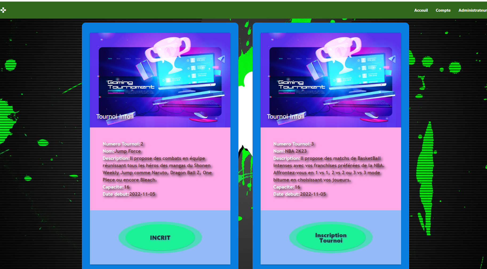
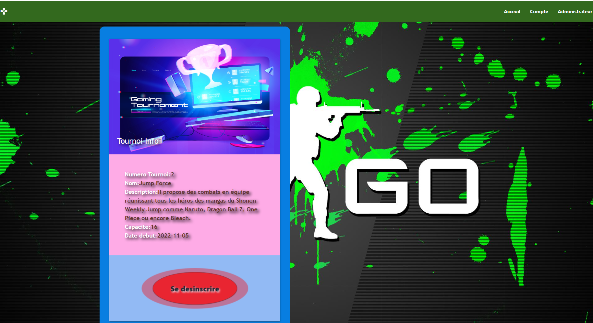
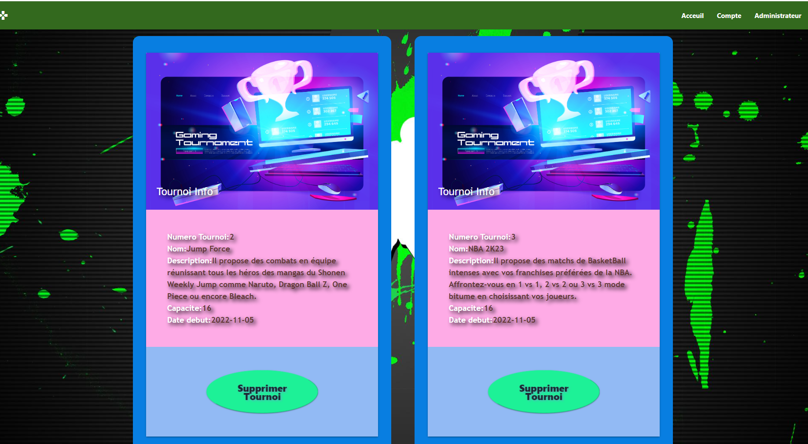
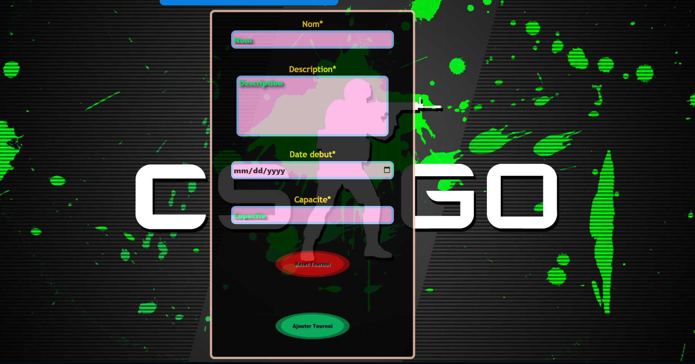

# Jeu-Video-Tournoi
 
 

  

## Table of Contents
* [Jeu-Video-Tournoi](#WhoYaGot)
* [Description](#Description)
* [Installation instructions](#Installation-instructions)
* [Usage Information](#Usage-Information)
* [Contribution Guidelines](#Contribution-Guidelines)
* [Test Instructions](#Test-Instructions)
* [License](#License)
* [Questions](#Questions)
## Description
* The Jeu video Tournoi is Jeu de Tournament video game Generator Manager; it is a website where people can register and unregister for a tournament with a single user. The administrator can add and delete a  tournament video game.
### Tournoi de video jeu, Reverse Engineering Database
 
## Installation instructions
NPM package requires for this project are :
* Node.js
* HTML
* CSS
* Material UI
* JavaScript
* SQLiteStudio
* Express
* Handlebars
## Usage Information
* This Jeu video Tournoi is for personal and professional use.
## Contribution Guidelines 
* This is a final product that is ready to be used.
### Tournoi de video jeu and all the links
* [Tournoi de jeu video Git Hub](https://github.com/MiguelJerome/Jeu-video-tournoi)
* [Tournoi de jeu video Heroku](https://warm-river-83946.herokuapp.com/)
## Test Instructions
* This Jeu Video works is also ready to be used.
### For using nodemon, you need to type in the command line (CLI) in the terminal:    npm run watch
### To start the server, you need to type in the command line (CLI) in the terminal:   npm start
## License
* MIT License

Copyright (c) [2022] [Miguel Jerome] [James Bell] [Marc-Raphael Chehab] [Synn Sloan Igondjo]

Permission is hereby granted, free of charge, to any person obtaining a copy
of this software and associated documentation files (the "Software"), to deal
in the Software without restriction, including without limitation the rights
to use, copy, modify, merge, publish, distribute, sublicense, and/or sell
copies of the Software, and to permit persons to whom the Software is
furnished to do so, subject to the following conditions:

The above copyright notice and this permission notice shall be included in all
copies or substantial portions of the Software.

THE SOFTWARE IS PROVIDED "AS IS", WITHOUT WARRANTY OF ANY KIND, EXPRESS OR
IMPLIED, INCLUDING BUT NOT LIMITED TO THE WARRANTIES OF MERCHANTABILITY,
FITNESS FOR A PARTICULAR PURPOSE AND NONINFRINGEMENT. IN NO EVENT SHALL THE
AUTHORS OR COPYRIGHT HOLDERS BE LIABLE FOR ANY CLAIM, DAMAGES OR OTHER
LIABILITY, WHETHER IN AN ACTION OF CONTRACT, TORT OR OTHERWISE, ARISING FROM,
OUT OF OR IN CONNECTION WITH THE SOFTWARE OR THE USE OR OTHER DEALINGS IN THE
SOFTWARE.
## Questions
* [Miguel-Jerome](https://github.com/MiguelJerome/) Github
* [James-Bell]() Github
* [Marc-Raphael-Chehab]() Github
* [Synn-Sloan-Igondjo]() Github
* How to reach us: You use contact us on GitHub

# References Project use
# Project TitleA
Handlebars View todo
 

## Table of Contents
* [Project TitleA](#Project-Title)
* [DescriptionA](#Description)
* [Installation instructionsA](#Installation-instructions)
* [Usage InformationA](#Usage-Information)
* [Test InstructionsA](#Test-Instructions)

## DescriptionA
    This application is used for creating a todo list with the help of an SQLite database by using the route and the service of handlebars.
## Installation instructionsA
* In the first step, you need to type in the command line (CLI) in the terminal:    npm i
## Usage InformationA
In the second step, you have two different options you can choose from:
* For using nodemon, you need to type in the command line (CLI) in the terminal:    npm run watch
* To start the server, you need to type in the command line (CLI) in the terminal:   npm start

## Test InstructionsA
Handlebars View todo and all the links
* [Handlebars View todo Git Hub](https://github.com/MiguelJerome/handlebarsViewTodo)
* [Handlebars View todo deploy to Heroku](https://frozen-harbor-56299.herokuapp.com/)

# Project TitleB
List todo Validation
 

## Table of Contents
* [Project TitleB](#Project-Title)
* [DescriptionB](#Description)
* [Installation instructionsB](#Installation-instructions)
* [Usage InformationB](#Usage-Information)
* [Test InstructionsB](#Test-Instructions)

## DescriptionB
    This application is used for creating a todo list with the help of an SQLite database by using the route and the service of handlebars and verify user input.
## Installation instructionsB
* In the first step, you need to type in the command line (CLI) in the terminal:    npm i
## Usage InformationB
In the second step, you have two different options you can choose from:
* For using nodemon, you need to type in the command line (CLI) in the terminal:    npm run watch
* To start the server, you need to type in the command line (CLI) in the terminal:   npm start

## Test InstructionsB
Handlebars View todo and all the links
* [Handlebars View todo Git Hub](https://github.com/MiguelJerome/todo-valadation)
* [Handlebars View todo deploy to Heroku](https://damp-falls-38473.herokuapp.com/ )